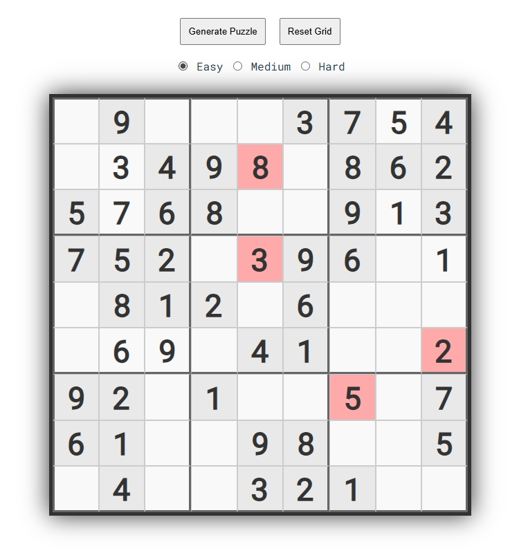

# Sudoku App

A Sudoku puzzle app built with Vue.js on the frontend and Express.js on the backend, powered by the [YouDoSudoku API](https://www.youdosudoku.com).

##  Features
- Generate puzzles by difficulty
- Solve interactively with validation feedback
- Backend API to fetch puzzles

##  Tech Stack
- **Frontend**: Vue 3
- **Backend**: Express.js
- **API**: [YouDoSudoku](https://www.youdosudoku.com)

## Screenshots
<p align="center">
  
  
</p>

#  Setup
## Frontend
```
cd frontend
```
```
npm install
```
```
npm run serve
```

## Backend
```
cd backend
```
```
npm install
```
```
node server.js
```